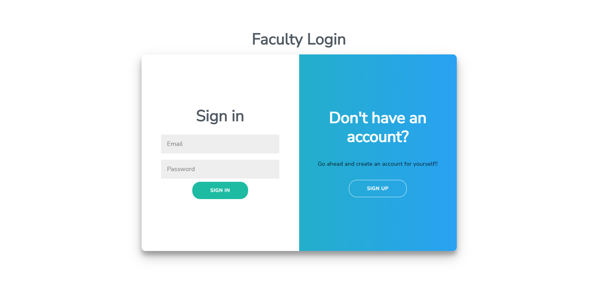
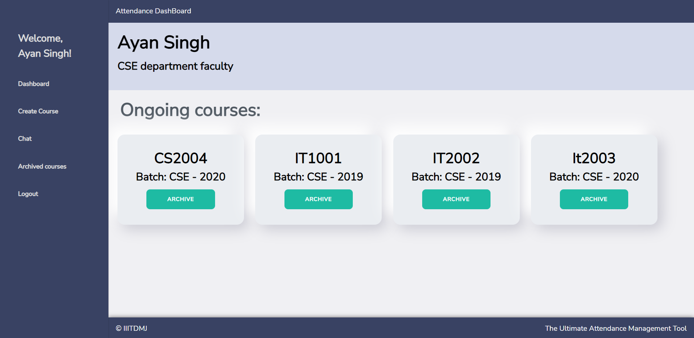
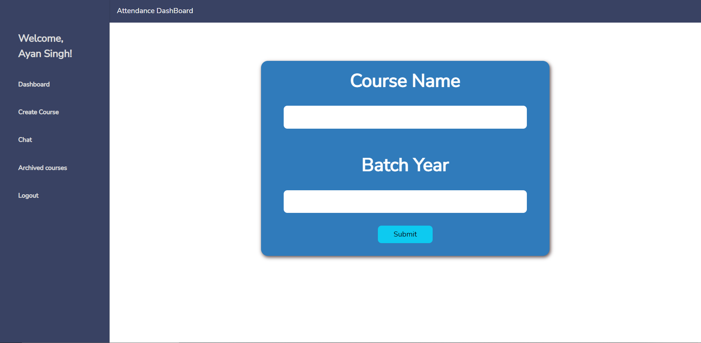
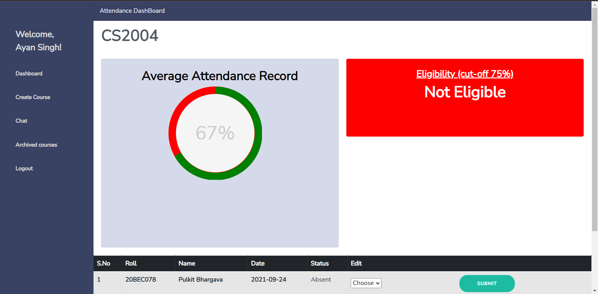
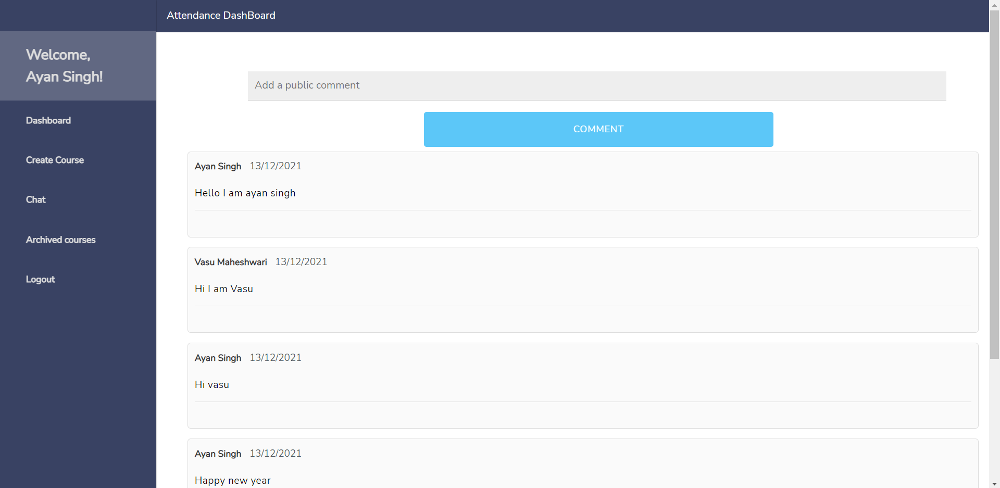

## Run Locally

Clone the project

```bash
git clone https://github.com/Pulkit007/Attendance-Management-SQL.git
```

Go to the project directory

```bash
cd Attendance-Management-SQL
```

Open the code Editor (preferred Visual Studio Code) and into the root folder run the below command

```bash
npm install
```

Then move to the client folder

```bash
cd client
```

and run the below command again

```bash
npm install
```

Then Start the Xampp/Wamp/Mysql server.

In the root folder run the command

```bash
cd ..
npm test
```

Then in the new terminal window run the following commands

```bash
cd client
npm start
```







